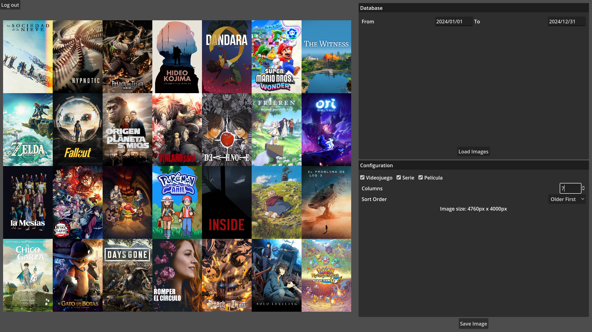

# MediaCoverRecap
A Godot Application that creates images with all covers from Notion database.

Deployed in [christt105.itch.io/media-cover-recap](https://christt105.itch.io/media-cover-recap).

Create a collage with the movies, series, games, or any multimedia content that you track in Notion.

If you want to create your own collages, you can get the template with usage instructions here: [Media Tracker Templates](https://christt105.notion.site/Template-1493d1da301448b5a197f1fdff57ce8d).

You can view my Notion page where I track everything here: [My Media Tracker](https://christt105.notion.site/Media-Tracker-2701938ab2da4b62a14efd572499b34d).

Made with Godot 4.3
